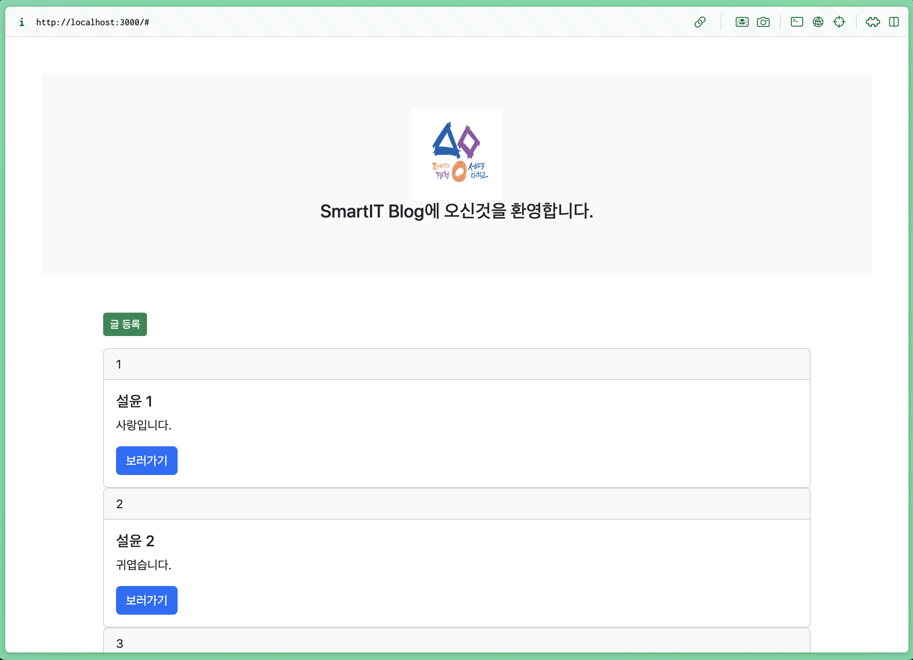
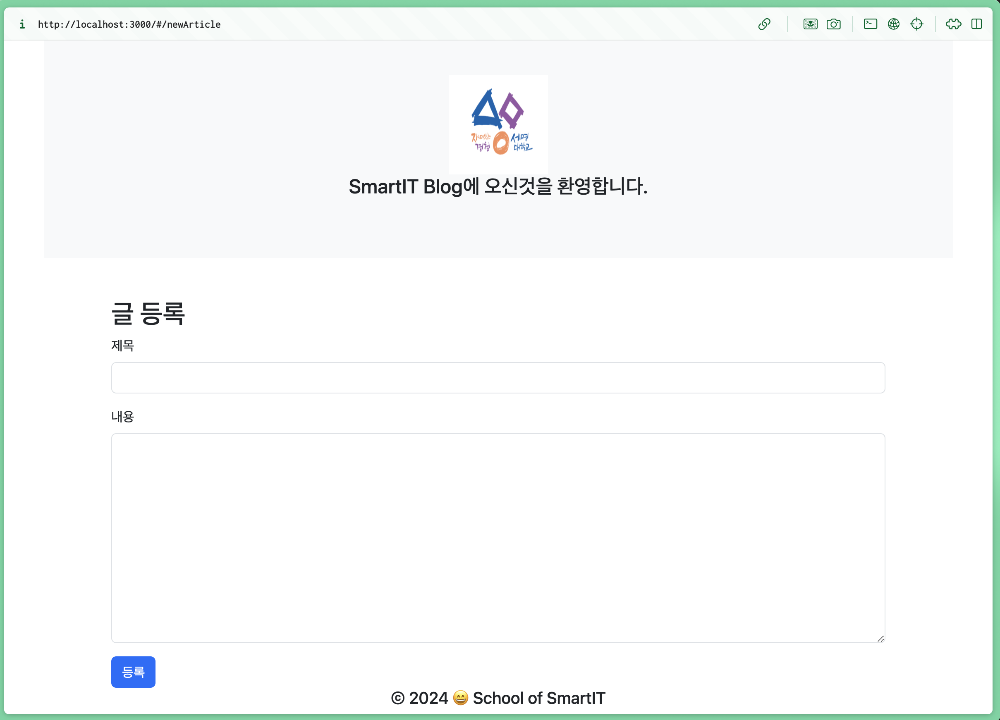
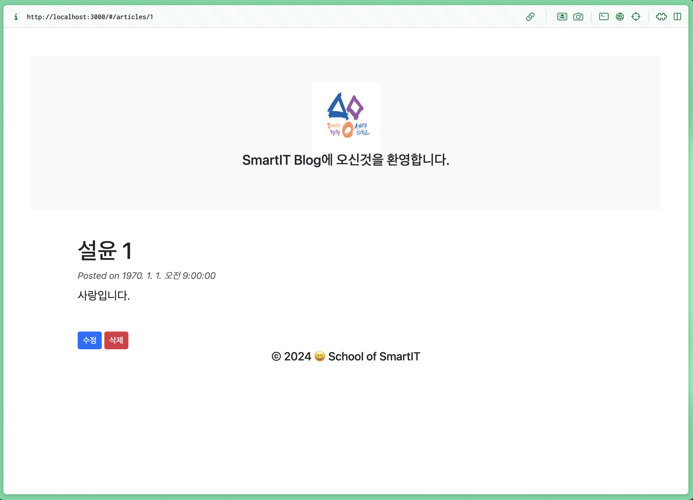
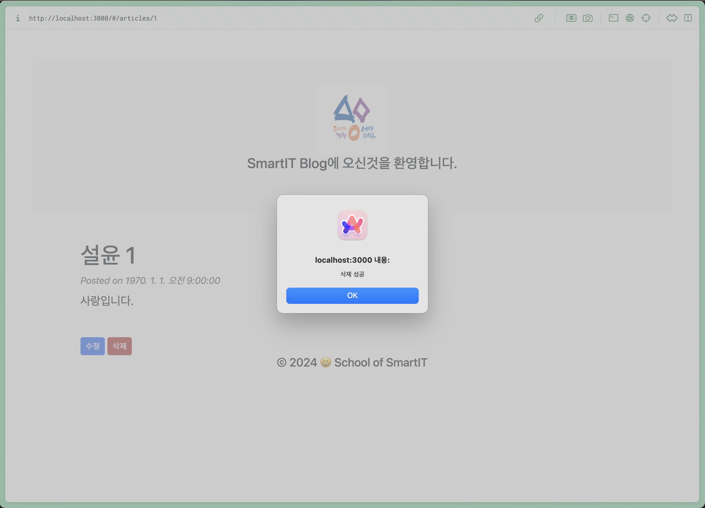
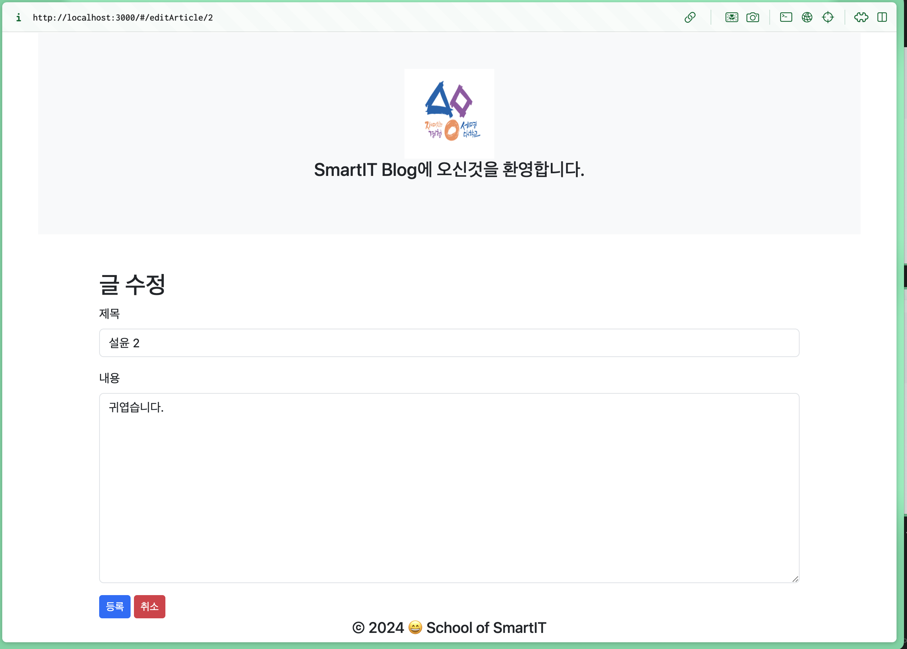

# React + Vite with Spring Boot + JPA(with MySQL or MariaDB)

## Author: `Sung-Hyuk Lee`

## 작성일시: `2024.6.12`

## 개요:`이 리포지토리는 React(Vite) with Bun 인 Front-end와 Spring Boot(JPA) Back-end를 결합하여 MySQL 또는 MariaDB 데이터베이스를 사용하는 웹 application을 구현하는 방법을 보여줍니다.`

## 참고로 이 프로젝트는 API호출 시 `localhost:80` 를 사용. 즉 포트를 80(HTTP 기본 포트)사용. 80은 생략가능합니다.전제 조건은 HTTP로 직접 접속시 생략 가능. 즉 `localhost` 이렇게 쓸 수 있다는 거죠. `.env`파일에서 `http://localhost`로 지정함.

## 주요 내용:

- `React + Vite + Bun`: Front-end 개발을 위한 최신 JavaScript 도구를 활용
- `Spring Boot + JPA`: Back-end 개발을 위한 강력하고 유연한 Framework 및 Database 접근 도구를 활용
- `MySQL 또는 MariaDB`: Data 저장 및 관리를 위한 안정적이고 성능 좋은 Database Management System
- `CORS 설정`: Front-end와 Back-end 간의 통신 허용

## 작동 방법

- 1 step: `git clone https://github.com/proleesh/semyungPrj.git`
- 2 step: `bun i` or `npm i`
- 3 step: `bun run dev` or `npm run dev`
- 4 step: If you want to build this project, you can using this command `bun run build` or `bun vite build` or `npm run build` or `npm vite build`
- 5 step: If you want to saw this building project you can using this command `bun serve dist` or `npm serve dist`

### 내용: thymeleaf에 있는 내용을 똑같이 vite+react+bun으로 구현

### 작업난이도: 중상

### 공개여부: 공개

### 작업한 이유: 교수님이 front-end와 back-end 마지막 기말평가에서 분리요구, 그리고 현실성 있게 작업.

### 결론: 성공적으로 만들어냄.

### 어려운 점: CORS 요청 거부. 하지만 고민 끝에 전부 해결.

> Back-end인 Spring Boot에서 ResponseEntity를 통해 JSON 데이터를 불러오는 작업, CORS를 Back-end인 Spring Boot에서 @CrossOrigin을 통해 모든 접근 허용 활성화 작업, Front-end인 React에서 해당 메서드 API 매칭 작업

### 실행화면:

- Article main page:
  
- Article Adding page:
  
- Article View for person page:
  
- Article if deleting alert:
  
- Article editing page:
  

### 참고 사이트:

<a href="https://react.dev/">React</a>
<a href="https://bun.sh/">Bun</a>
<a href="https://vitejs.dev/">Vite</a>
